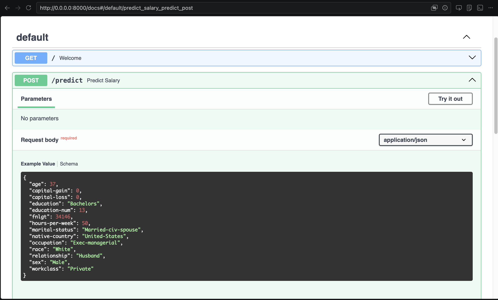
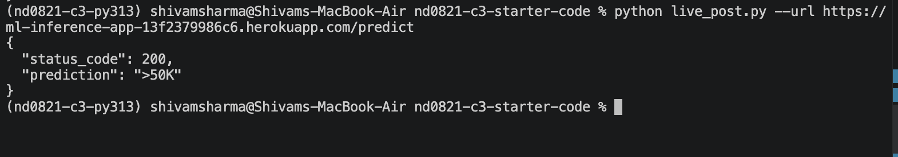
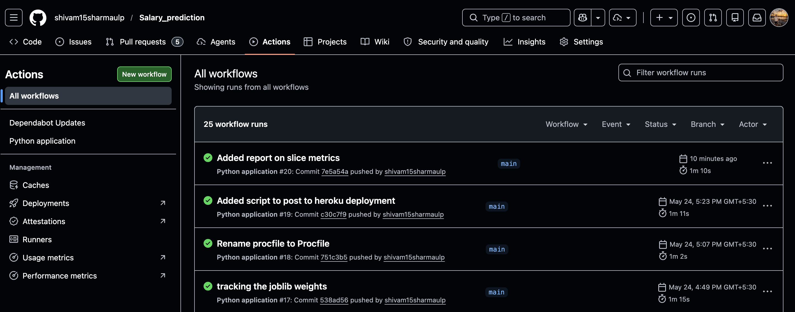
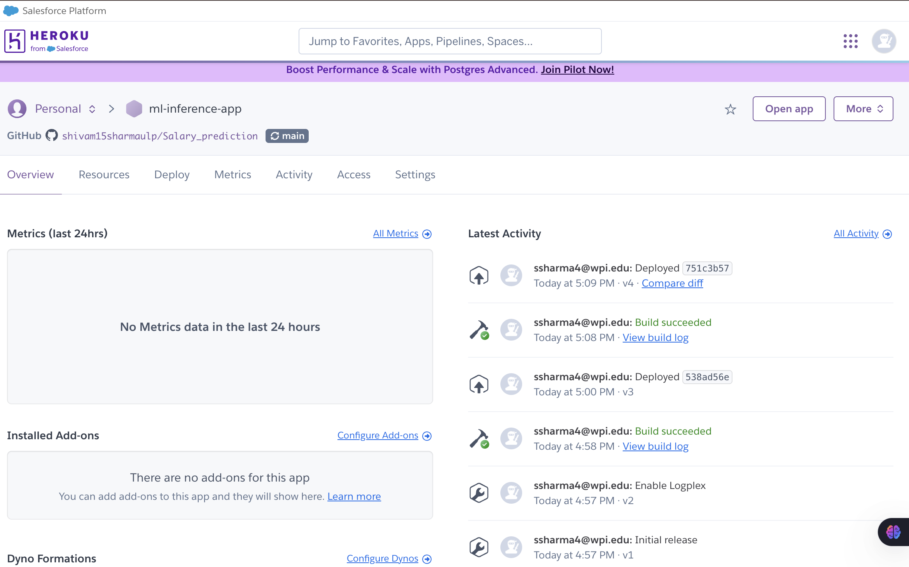

# Salary Prediction — Census Income API

A production-ready ML pipeline that predicts whether a person earns **>50K** or **≤50K** per year from U.S. Census demographic features. The project covers the full MLOps lifecycle: data preprocessing, model training with cross-validation, slice-based fairness evaluation, dataset and model artifact tracking with DVC backed by AWS S3, a FastAPI inference service, and automated CI/CD via GitHub Actions with deployment to Heroku.

---

## Tech Stack

| Layer | Tools |
|---|---|
| Language | Python 3.13 |
| ML | scikit-learn (`RandomForestClassifier`) |
| Data & Artifact Tracking | DVC + AWS S3 |
| API | FastAPI + Pydantic + Uvicorn |
| Testing | pytest + httpx |
| CI | GitHub Actions |
| CD | Heroku (GitHub-connected, auto-deploy on green CI) |

---

## Project Structure

```
.
├── main.py                    # FastAPI app entry point
├── live_post.py               # Script to POST to the live Heroku endpoint
├── Procfile                   # Heroku process declaration
├── requirements.txt
├── runtime.txt                # python-3.13.x
└── starter/
    ├── data/census.csv        # Raw census dataset
    ├── model/                 # Saved model artifacts (joblib)
    ├── screenshots/           # CI, CD, and API screenshots
    └── starter/
        ├── train_model.py     # Training script
        └── ml/
            ├── data.py        # Preprocessing helpers
            └── model.py       # train / inference / compute_model_metrics
```

---

## Quick Start

**Requirements:** Python 3.13

```bash
# Create and activate a virtual environment
python3.13 -m venv .venv
source .venv/bin/activate          # Windows: .venv\Scripts\activate

# Install dependencies
pip install -r requirements.txt

# Pull the tracked dataset and model artifacts from DVC/S3
dvc pull

# Train the model (saves artifacts to starter/model/)
python starter/starter/train_model.py

# Run tests
pytest starter/tests/

# Start the API locally
uvicorn main:app --reload
```

---

## Data And Model Tracking

This project uses `DVC` to version the dataset and saved model artifacts outside Git, with `AWS S3` configured as the remote storage backend. The tracked artifacts include the census dataset in `starter/data/` and the trained joblib files in `starter/model/`.

Typical commands:

```bash
# Track updated data or model artifacts
dvc add starter/data
dvc add starter/model

# Upload tracked artifacts to S3
dvc push

# Restore tracked artifacts from S3
dvc pull
```

---

## API

The FastAPI app exposes two endpoints.

### `GET /`

Returns a welcome message.


### `POST /predict`

Accepts a JSON body matching the `CensusRecord` schema and returns either `"<=50K"` or `">50K"`.



#### Example request

```bash
python live_post.py --url https://<your-heroku-app>.herokuapp.com/predict
```



---

## CI/CD

### Continuous Integration — GitHub Actions

Every push runs `pytest` and `flake8`. Automatic deployment to Heroku is blocked unless CI passes.



### Continuous Deployment — Heroku

The Heroku app (`ml-inference-app`) is connected to this repository's `main` branch and auto-deploys only after a green CI build.



---

## Model Card

### Model Details

This project uses a supervised binary classification model to predict whether a person's income is `<=50K` or `>50K` from census-style demographic and employment features. The model was created by Shivam Sharma for the Udacity ML DevOps Engineer Nanodegree final project.

- Model type: `RandomForestClassifier`
- Library: scikit-learn
- Number of trees: `100`
- Random seed: `42`
- Parallelism: `n_jobs=-1`
- Cross-validation: `StratifiedKFold(n_splits=5, shuffle=True, random_state=42)`
- Training script: `starter/starter/train_model.py`
- Supporting preprocessing: `starter/starter/ml/data.py`

The preprocessing pipeline strips whitespace from CSV column names, one-hot encodes categorical features with `OneHotEncoder(handle_unknown="ignore")`, and binarizes the `salary` target with `LabelBinarizer`.

Reference: https://arxiv.org/pdf/1810.03993.pdf

### Intended Use

This model is intended for educational use as part of an end-to-end MLOps workflow covering training, evaluation, slice-based performance analysis, CI, and deployment. Intended users are Udacity reviewers, students, and developers evaluating the project pipeline.

This model is not intended for production decision-making in hiring, compensation, lending, insurance, immigration, or any other high-stakes domain.

### Data

The model is trained on the census income dataset stored in `starter/data/census.csv`. The label is `salary`, which is converted into a binary outcome representing income `<=50K` or `>50K`.

Training and evaluation use an 80/20 train-test split from the same dataset. The pipeline uses the following categorical features for one-hot encoding:

- `workclass`
- `education`
- `marital-status`
- `occupation`
- `relationship`
- `race`
- `sex`
- `native-country`

Continuous features such as age, fnlgt, education-num, capital-gain, capital-loss, and hours-per-week are passed through without scaling.

### Metrics

#### Overall Performance

| Metric | Value |
| --- | ---: |
| Mean CV F1 | 0.6649 |
| CV F1 standard deviation | 0.0057 |
| Test precision | 0.7391 |
| Test recall | 0.6384 |
| Test F1 | 0.6851 |


#### Key Slice Performance

The project computes slice metrics across categorical feature values. Selected examples are shown below.

| Feature | Slice | Precision | Recall | F1 |
| --- | --- | ---: | ---: | ---: |
| sex | Female | 0.726 | 0.511 | 0.599 |
| sex | Male | 0.741 | 0.661 | 0.699 |
| race | White | 0.737 | 0.637 | 0.683 |
| race | Black | 0.741 | 0.615 | 0.672 |
| race | Asian-Pac-Islander | 0.786 | 0.710 | 0.746 |
| education | HS-grad | 0.646 | 0.423 | 0.511 |
| education | Bachelors | 0.757 | 0.733 | 0.745 |
| education | Masters | 0.826 | 0.850 | 0.838 |


### Bias and Fairness Considerations

The model uses sensitive or demographic-adjacent attributes such as `sex`, `race`, `relationship`, and `native-country`. These features can encode or proxy protected characteristics and structural inequities present in the source data.

The slice metrics show uneven performance across groups. For example, the F1 score for `sex=Female` is lower than for `sex=Male`, and some small subgroups show unstable or extreme metric values because they contain very few examples. Those differences indicate that the model can reflect data imbalance and historical bias rather than neutral income prediction.

### Caveats

- The test set is drawn from the same source dataset as the training set, so this is not an external validation.
- Slice metrics for rare categories are noisy and can look artificially perfect or artificially poor because the support is very small.
- The model is appropriate for coursework and demonstration, not for real-world policy or business decisions.
- If the dataset, preprocessing, or model parameters change, the reported metrics and plots should be regenerated.

---

## License

See [LICENSE.txt](LICENSE.txt).
