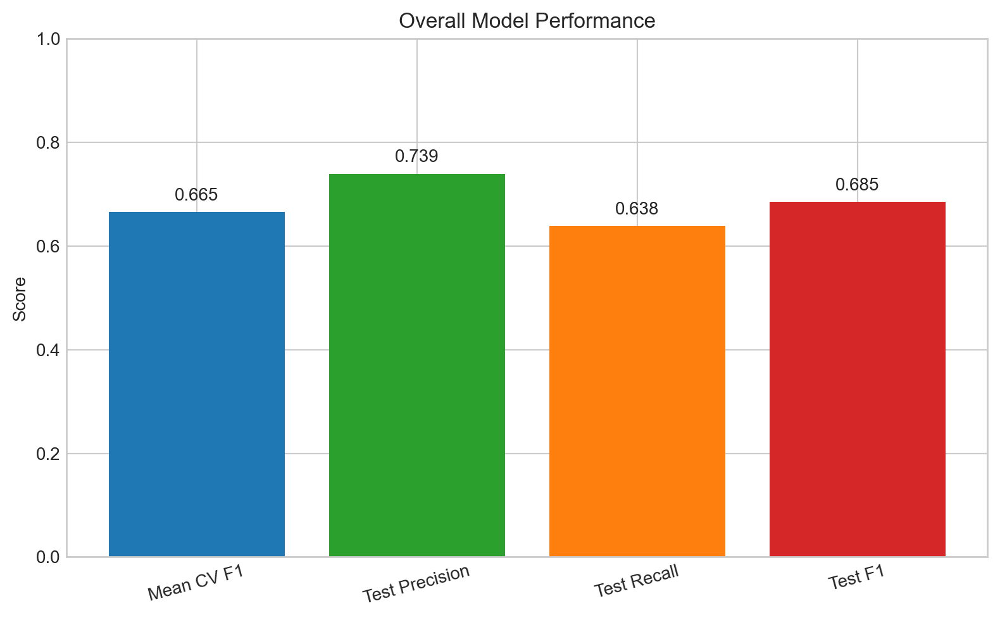
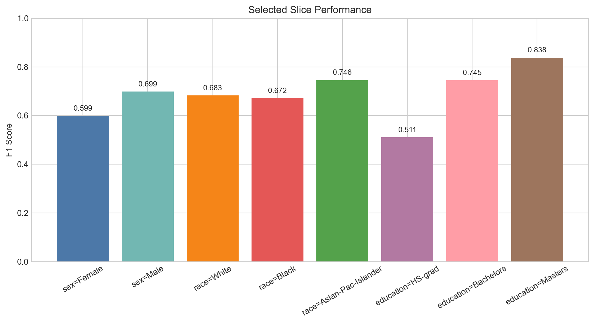

# Model Card

For additional information see the Model Card paper: https://arxiv.org/pdf/1810.03993.pdf

## Model Details

This project uses a supervised binary classification model to predict whether a person's income is `<=50K` or `>50K` based on census-style demographic and employment information.

- Author: Shivam Sharma
- Model: `RandomForestClassifier`
- Library: scikit-learn
- Hyperparameters: `n_estimators=100`, `random_state=42`, `n_jobs=-1`
- Cross-validation: 5-fold `StratifiedKFold` with F1 scoring
- Training script: `starter/starter/train_model.py`
- Preprocessing: `OneHotEncoder(handle_unknown="ignore")` and `LabelBinarizer`

## Intended Use

The model is intended for educational use in the Udacity ML DevOps final project. Intended users include course reviewers, students, and developers validating the ML pipeline.

The model is not intended for real-world decision support in hiring, lending, compensation, insurance, legal, or other high-stakes settings.

## Training Data

The training data comes from `starter/data/census.csv`. The target column is `salary`, which is binarized into income `<=50K` or `>50K`.

The following categorical features are one-hot encoded during preprocessing:

- `workclass`
- `education`
- `marital-status`
- `occupation`
- `relationship`
- `race`
- `sex`
- `native-country`

Other numeric features are passed through as continuous inputs. The dataset column names are stripped of surrounding whitespace before processing.

## Evaluation Data

Evaluation uses a held-out 20% test split from the same census dataset.

## Metrics

Overall metrics:

- Mean CV F1: `0.6649`
- CV F1 standard deviation: `0.0057`
- Test precision: `0.7391`
- Test recall: `0.6384`
- Test F1: `0.6851`

Selected slice metrics:

| Feature | Slice | Precision | Recall | F1 |
| --- | --- | ---: | ---: | ---: |
| sex | Female | 0.726 | 0.511 | 0.599 |
| sex | Male | 0.741 | 0.661 | 0.699 |
| race | White | 0.737 | 0.637 | 0.683 |
| race | Black | 0.741 | 0.615 | 0.672 |
| race | Asian-Pac-Islander | 0.786 | 0.710 | 0.746 |
| education | HS-grad | 0.646 | 0.423 | 0.511 |
| education | Bachelors | 0.757 | 0.733 | 0.745 |
| education | Masters | 0.826 | 0.850 | 0.838 |

## Ethical Considerations

The model uses demographic features such as `sex`, `race`, `relationship`, and `native-country`, which can proxy protected attributes and embed historical inequities. Slice-based performance differences indicate that the model can perform unevenly across groups and should not be treated as fair or neutral by default.

## Caveats and Recommendations

- This model is evaluated only on a holdout split from the same dataset, not on an external dataset.
- Slice metrics for low-support categories can be unstable.
- The model is suitable for coursework and demonstration, not production decision-making.
- Any retraining or preprocessing changes should be accompanied by updated metrics and regenerated plots.
